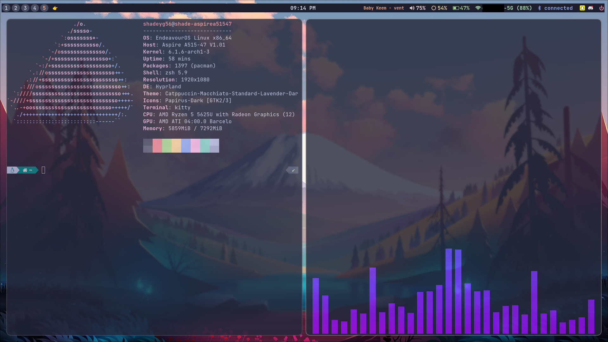

# dotfiles
Configuration files for my laptop running EndeavourOS

# Packages
There are dotfiles for the following packages

- `hyprland`
- `waybar-hyprland`
    - `adios`
    - `pavucontrol`
    - `libnm`
    - `brightnessctl`
    - `pamixer`
    - `blueman`
- `hyprpaper`
- `swaylock`
- `cava`
- `wofi`
- `btop`

# Fonts
The following fonts are installed
- JetBrains Mono
- Font Awesome